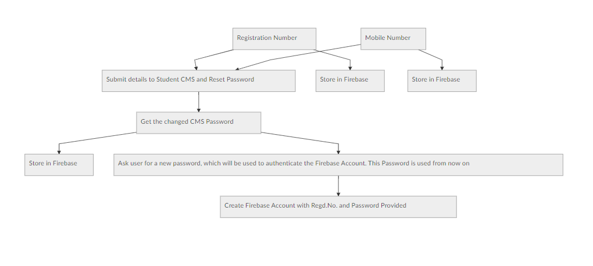
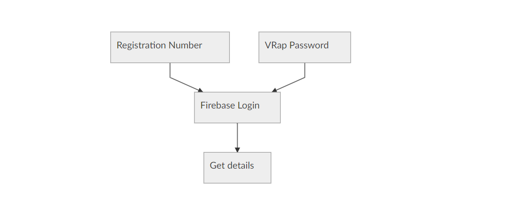

# VRap

VRap is a college management app made for Velagapudi Ramakrishna Siddartha Engineering College, Vijayawada.

But unfortunately, couldn't be completed and is abandoned in it's infancy.

This project is open sourced so that any future gen students can continue this project or use this as a reference and make their own one.

# Features (Implemented/TODO)

 - Direct document access from Lecturers/Class Representatives.
 - Student Database
 - Advanced academic calendar to notify students of Curricular and Extra-Curricular Activities with Push Notifications.
 - Real-time Broadcasts from Administration and Staff.
 - In-App Updated
 - Student Profiling (Student Details, Achievements and all Records in one place!)
 - Automatic Wi-Fi Authentication (Authenticate the students automatically to log into the Wi-Fi)
 - Feel feel to add any more Features as you wish as it is all yours now :p

Many of the above mentioned features are not implemented.

# Sign Up Logic

# Login Logic

# Implementations done till date
### User Authentication:
The User Sign Up and Log In Works as shown:

### Calendar Flow:
Calendar works as below:

# OG:
### ECE:
 - Sai Krishna
 - Gnana Sai
 - Lubna
 - Madhurima
